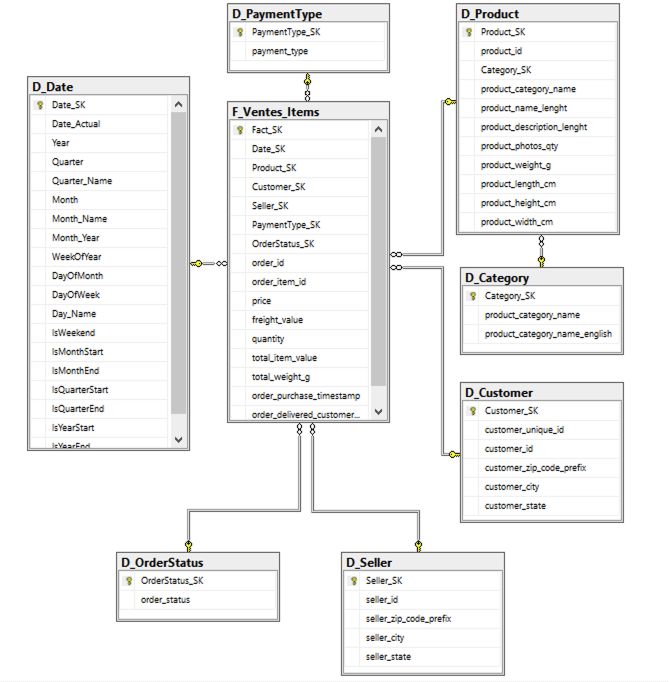

# Portfolio – Franck Ngaha (alias fngaha)
Bienvenue dans mon espace GitHub où je publie mes projets Python, IA et data.

# Labo BI – Olist (Marketplace brésilien)

Ce projet est réalisé dans le cadre du module **"Labo modélisation de données"** de la formation *Développeur orienté IA*.  
Il met en place un **datawarehouse Olist** complet sur SQL Server, un **ETL Python** (pandas + SQLAlchemy) et un **modèle Power BI** pour l’analyse des ventes e-commerce.

Les données Olist proviennent du dataset public :
- Kaggle – *Brazilian E-Commerce Public Dataset by Olist*.

---

## Objectifs du projet

- Comprendre et implémenter un **modèle en étoile** (star schema) à partir des données Olist.
- Mettre en place un **staging** puis un **datawarehouse** dans SQL Server.
- Développer un **ETL 100 % Python** :
  - EXTRACT depuis le staging SQL Server
  - TRANSFORM vers des dimensions et une table de faits
  - LOAD dans le datawarehouse
- Construire un **dashboard Power BI** connecté au DW.

---

## Architecture du projet

```text
labo-bi-olist/
│
├── 01_comprehension_donnees/             # Notes et analyse des datasets Olist
├── 02_modele_dimensionnel/               # Schéma en étoile, description des dimensions/faits
├── 03_etl/
│   ├── etl/
│   │   ├── config.yaml                   # Paramètres de connexion SQL Server (staging + DW)
│   │   ├── db_connection.py              # Connexion SQLAlchemy + pyodbc
│   │   ├── extract_staging.py            # Extraction des tables de staging
│   │   ├── extract_dw.py                 # Lecture des dimensions dans le DW
│   │   ├── transform_dimensions.py       # Construction des dimensions
│   │   ├── transform_facts.py            # Construction de la table de faits F_Ventes_Items
│   │   ├── load_dimensions.py            # Chargement des dimensions dans le DW
│   │   ├── load_facts.py                 # Chargement de la table de faits
│   │   └── main.py                       # Orchestration de l’ETL (fonctions run_etl_*)
│   ├── mapping_sources_cibles.md         # Mapping source → cible (staging → dimensions/faits)
│   ├── test_connexion.py                 # Script de test rapide de la connexion SQL
│   └── notes_etl.md
│
├── 04_datawarehouse/
│   ├── Create_Olist_DW.sql               # Création de la base DW
│   ├── Create_D_Date.sql                 # Création + peuplement de D_Date
│   ├── Create_D_Category.sql
│   ├── Create_D_Product.sql
│   ├── Create_D_Customer.sql
│   ├── Create_D_Seller.sql
│   ├── Create_D_PaymentType.sql
│   ├── Create_D_OrderStatus.sql
│   ├── Create_F_Ventes_Items.sql         # Table de faits des ventes
│   └── diagramme_modele_final.png
│
├── 05_reporting/
│   ├── powerbi/
│   └── └── Olist_DW_Report.pbix          # Rapport Power BI connecté au DW (non versionné si lourd)
│
├── journal_de_bord.md                    # Journal de bord de la progression
│
└── README.md                             # Ce fichier
```

---

## Modèle dimensionnel

Le datawarehouse est un **schéma en étoile** centré sur les ventes :

### Table de faits :

- `F_Ventes_Items` – grain : 1 ligne par `(order_id, order_item_id)`

### Dimensions :

- `D_Date` – calendrier (Date_SK, Date_Actual, Year, Month, …)

- `D_Product` – produits (Product_SK, product_id, catégorie, caractéristiques)

- `D_Category` – catégories produit

- `D_Customer` – clients (Customer_SK, customer_unique_id, localisation)

- `D_Seller` – vendeurs (Seller_SK, localisation)

- `D_PaymentType` – type de paiement

- `D_OrderStatus` – statut des commandes



---

## ETL Python

L’ETL est écrit en Python avec :

- pandas pour les transformations

- SQLAlchemy + pyodbc pour la connexion à SQL Server

- YAML pour la configuration (config.yaml)

### Flux général

1. EXTRACT (staging SQL Server) :

  - orders, order_items, order_payments, products, customers, sellers, etc.

2. TRANSFORM :

  - Construction des dimensions :

    - D_Category, D_Product, D_Customer, D_Seller, D_PaymentType, D_OrderStatus

  - Construction de la table de faits F_Ventes_Items :

    - jointure entre order_items, orders, customers, products, sellers, order_payments

    - lookup des SK depuis les dimensions

  - calcul des mesures (total_item_value, total_weight_g, etc.)

3. LOAD (DW Olist_DW) :

  - TRUNCATE + chargement des dimensions

  - TRUNCATE + chargement de la fact

---

## Modèle Power BI

Power BI Desktop se connecte directement à la base Olist_DW (Import) et charge :

- Dimensions : `D_Date`, `D_Product`, `D_Customer`, `D_Seller`, `D_PaymentType`, `D_OrderStatus`

- Fact : `F_Ventes_Items`

Les relations sont basées sur les clés substituts (*_SK), ce qui donne un schéma en étoile propre.

Plusieurs mesures DAX sont définies :

- Total Ventes

- Total Quantité

- Total Delivery

Poids Total (g)

Nb Commandes

Nb Produits

- Nb Clients

etc.

Des pages de rapport typiques :

Vue d’ensemble : KPIs, ventes par année, ventes par statut

Produits & catégories : top catégories, top produits

Clients & géographie : ventes par état, ville, type de paiement

---

## Améliorations possibles

- Ajout de logs et de tests automatiques sur l’ETL Python.

- Ajout d’un orchestrateur (fonction run_etl_all, scheduler).

- Enrichissement du modèle Power BI :

  - temps de livraison moyen

  - analyse des annulations

  - segmentation clients.

- Déploiement du rapport Power BI sur le service Power BI (si licence disponible).

---

## Statut du projet

- [x] Compréhension des données terminée
- [x] Modèle dimensionnel validé
- [x] ETL implémenté
- [x] Datawarehouse alimenté
- [x] Rapports BI créés
- [ ] Documentation finalisée

---

## Author
**Franck Ngaha**  
Developer • Data Science & AI Enthusiast  
[franck.o.ngaha@gmail.com](mailto:franck.o.ngaha@gmail.com)  
[GitHub Profile](https://github.com/fngaha)